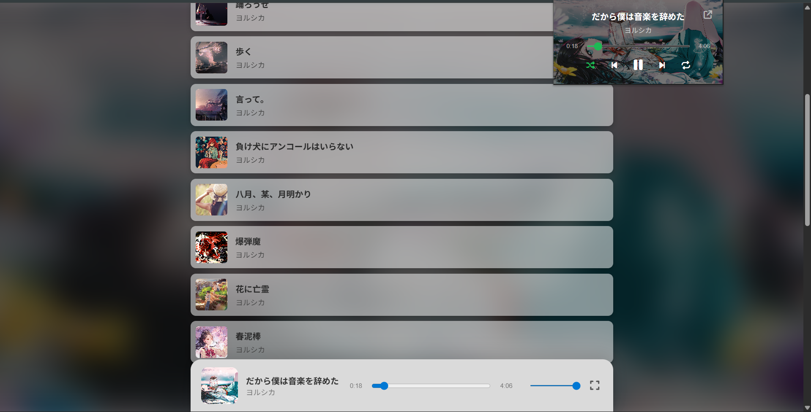
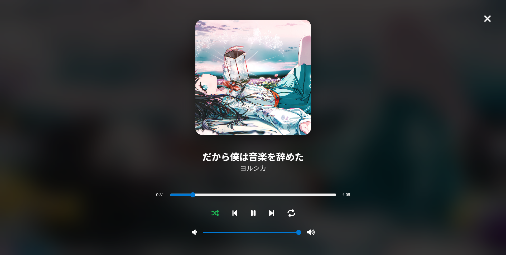

# 🎵 SonicUV

A lightweight, local music streaming server built to serve my personal `osu!` music library using a blazing-fast, modern Python stack and a custom Chrome Extension.



## 🚀 The Project Concept
SonicUV acts as a "Local Spotify." Instead of relying on a complex frontend framework or external databases, it uses an in-memory dictionary database to index local audio files and streams them directly to a vanilla HTML/JS frontend. 

The primary goal of this project was to build a clean client-server architecture using modern backend tools, separate the heavy lifting of API routing from client-side search logic, and implement a custom Manifest V3 browser extension for remote control.

## 🛠️ Tech Stack
* **Backend:** [FastAPI](https://fastapi.tiangolo.com/) (RESTful routing and chunked file streaming)
* **Package Management:** [uv](https://github.com/astral-sh/uv) (Blazing fast Python dependency management written in Rust)
* **Frontend:** Vanilla HTML, CSS, and JavaScript (Glassmorphism UI, CSS Flexbox)
* **Infrastructure:** Docker & Docker Compose (Running as a non-root user for security)
* **Client:** Custom Manifest V3 Chrome/Edge Extension (Offscreen Audio API)

## ✨ Features
- **Instant Search:** Lightning-fast, client-side search filtering by Artist, Title, or Tags.
- **Async Audio Streaming:** Serves playable audio streams via dynamic endpoints (`/api/play/{id}`) without loading the entire file into memory.
- **Glassmorphism Player:** A premium, responsive UI featuring dynamic blurred background art, custom media controls, and state management.
- **Browser Extension:** A custom Chrome extension that runs an invisible background service worker, allowing you to control playback, skip songs, and view current track info without keeping the web app open.
- **Containerized:** Fully packaged using Docker Compose with volume mounts for the local audio library.



## 💻 How to Run (Docker/Production)
The recommended way to run SonicUV is via Docker. Ensure your `docker-compose.yml` points to your local music directory.

1. Clone the repository.
2. Build and start the container in the background:
   ```bash
   docker compose up --build -d
   ```
3. Open `http://localhost:8000` in your browser.

## 💻 How to Run (Local Development)
1. Clone the repository.
2. Install dependencies using `uv`:
   ```bash
   uv sync
   ```
3. Start the server with hot-reloading:
   ```bash
   uv run uvicorn app.main:app --reload
   ```

## 🧩 Installing the Chrome Extension
1. Open Chrome and navigate to chrome://extensions/.
2. Toggle Developer mode on in the top right corner.
3. Click Load unpacked and select the extension/ folder in this repository.
4. Pin the extension and hit play!

> [!NOTE]
> The `docker-compose.yml` relies on the Windows `%LOCALAPPDATA%` environment variable to find your osu! songs. If you are on Linux/macOS, please update the volume mount path in the compose file manually.